# 🛡️ Sentinel-PIX: Enterprise Real-Time Anti-Fraud & MLOps Engine

<div align="center">

[](https://www.python.org/)
[](https://fastapi.tiangolo.com/)
[](https://streamlit.io/)
[](https://mlflow.org/)
[](https://redis.io/)
[](https://www.docker.com/)
[]()

**[🇺🇸 English Version](README.md)** | **[🇧🇷 Versão em Português](README_PT.md)**

</div>

> **Real-Time Instant Payment (PIX) Anti-Fraud Decision Engine featuring a Multi-Layer Hybrid Architecture, Dual Feature Store (Redis + PostgreSQL/SQLite), SHAP Local Explainability, MLOps Governance with MLflow, Continuous Data & Prediction Drift Monitoring, and an Interactive Live Operations Dashboard.**

---

## 📌 Executive Summary

In modern instant payment ecosystems (such as Brazil's PIX, FedNow, or SEPA Instant), fraud prevention demands **sub-25ms decision latency** while solving the critical trade-off between intercepting financial losses and minimizing friction for legitimate cardholders.

**Sentinel-PIX** implements an enterprise **Defense-in-Depth** decision triad:
- **`APPROVE` (`APROVAR`):** Low-risk transactions executed immediately (< 15ms latency).
- **`CONFIRM` (`CONFIRMAR`):** Smart friction — temporary step-up requiring facial biometrics or multi-factor authentication (2FA).
- **`BLOCK` (`BLOQUEAR`):** High-risk transactions immediately intercepted and dispatched to the Fraud Analyst Investigation Queue.

---

## 🏛️ System Architecture

```mermaid
flowchart TD
    subgraph Ingestion & Client
        A[Mobile App / Payment Gateway] -->|Lightweight Payload: 6-8 features| B[FastAPI Engine /api/v1/analyze]
    end

    subgraph Dual Feature Store Layer
        B -->|1. Static KYC & Customer Profile| C1[(Offline Feature Store<br/>PostgreSQL / SQLite)]
        B -->|2. High-Frequency 1h/24h Aggregates| C2[(Online Feature Store<br/>Redis In-Memory)]
        B -->|3. Runtime Derivations| C3[Runtime Calculations<br/>Ratios, Circadian, Bands]
        C1 & C2 & C3 --> D[Vector Assembler & Canonical Preprocessing]
    end

    subgraph Hybrid Decision Engine
        D --> E1[Behavioral Analytics Engine<br/>Typing Speed / Session / Battery]
        D --> E2[Social Engineering Heuristics<br/>Fake Call Center / Coercion]
        D --> E3[Temporal Graph Engine<br/>Mule Networks / Fan-In / Fan-Out]
        D --> E4[Supervised LightGBM + Isolation Forest<br/>Distilled Ensemble R5B22]
        E1 & E2 & E3 & E4 --> F[Decision Engine & Policy Overrides]
        F --> G{Decision Triad}
    end

    subgraph Action & Observability Sink
        G -->|APPROVE| H1[Client Response + SHAP]
        G -->|CONFIRM / BLOCK| H2[(Audit DB / Triage Queue)]
        H2 --> H1
        B -.->|Telemetry & PSI Drift| I[MLflow Tracking & Drift Monitor]
        B -.->|Real-Time Stream| J[Streamlit Live Operations Dashboard]
        I -.-> J
        H2 -.-> J
    end
```



---

## 🚀 Key Engineering & Machine Learning Highlights

### 1. Dual Feature Store Strategy (Zero Training-Serving Skew)
- **Lightweight Ingestion:** The client sends only 6 to 8 core fields (`account_id`, `receiver_pix_key`, `amount`, `timestamp`, `device_id`, `channel`).
- **Offline Feature Store (PostgreSQL / SQLite):** Serves static demographic and cadastral attributes (account age, credit score, monthly income, diurnal/nocturnal limits, PEP status).
- **Online Feature Store (Redis):** Serves sub-millisecond sliding window aggregates (1h/24h counts and velocity sums, mobile typing speed, receiver mule reputation scores).
- **Canonical Feature Reconstruction (`preprocessing.py`):** Deterministically reconstructs the full 55/78 canonical feature vector before model execution.

### 2. Multi-Layer Hybrid Engine (Baseline R5B22)
- **Supervised LightGBM (Distilled):** Optimized for high recall with asymmetric loss penalty.
- **Unsupervised Isolation Forest (800 Trees):** Unsupervised anomaly score detecting unknown zero-day fraud patterns without training contamination.
- **Social Engineering (SE) Heuristics:** 8 specialized pattern detectors (e.g., *Fake Call Center*, *Kidnapping/Coercion*, *WhatsApp Impersonation*).
- **Behavioral Analytics (BEH):** 6 leakage-free behavioral factors (session duration anomalies, device switching, hesitation indicators).
- **Graph Investigation Engine:** Topological graph analytics identifying mule rings, bridge accounts, and rapid fan-out topologies.

### 3. Real-Time Explainability (SHAP Values)
- Per-transaction local Shapley value calculation (`shap.TreeExplainer`) returning the exact top-contributing positive and negative features for every decision.

### 4. MLOps Governance & Real-Time Drift Monitoring
- **MLflow Tracking & Model Registry:** Comprehensive logging of official benchmark runs, hyperparameters, confusion matrices, and serialized model artifacts.
- **Real-Time Data Drift Detector:** Continuous computation of **PSI (Population Stability Index)** and Kolmogorov-Smirnov statistical tests over sliding observation windows.

---

## 📊 Production Benchmark Metrics (R5B22)

Evaluated on a dataset of **113,844 transactions** (1,465 confirmed frauds and 112,379 legitimate operations):

| Metric | Performance | Production Target |
|---|---:|:---:|
| **Global Recall** | **99.86%** (1,463 / 1,465 frauds detected) | ≥ 99.0% |
| **False Positive Rate (FPR)** | **0.957%** (under 1%) | < 1.0% |
| **Precision in BLOCK** | **65.65%** | Maximize |
| **Missed Frauds in APPROVE** | **Only 2 cases** out of 111k | ≤ 5 |
| **p95 Latency SLA** | **< 15 ms** | SLA < 25 ms |

---

## 🖥️ Live Streamlit Dashboard

The project includes an enterprise **Operations & Investigation Dashboard**:
1. **Live Cockpit:** Real-time throughput gauge, decision distribution pie charts, and streaming transaction feeds.
2. **Fraud Investigation Desk:** Detailed case dossiers, SHAP waterfall bar charts, 2D interactive network graphs (`networkx` + `plotly`), and analyst action buttons (`Approve`, `Confirm Fraud & Block Mule`).
3. **MLOps & Baseline Evals:** Confusion matrix, MLflow official run parameters, and real-time PSI drift monitoring.
4. **Data Lineage:** Full architectural breakdown mapping the 4 feature sources (RT Ingestion, Offline Store, Online Store, Runtime Derivations).
5. **Interactive Sandbox:** One-off manual transaction testing and attack preset triggers.

---

## ⚡ Quickstart Guide

### Option 1: Docker Compose (Recommended)

Boot the entire multi-service stack (FastAPI Engine + Redis In-Memory + Streamlit Dashboard) with a single command:

```bash
docker compose up --build
```

- **REST API (Swagger UI):** [http://localhost:8000/docs](http://localhost:8000/docs)
- **Interactive Live Dashboard:** [http://localhost:8501](http://localhost:8501)

---

### Option 2: Local Python Execution

1. **Create and activate the virtual environment:**
```bash
python -m venv venv
# On Windows:
venv\Scripts\activate
# On Linux/macOS:
source venv/bin/activate
```

2. **Install dependencies:**
```bash
pip install -r requirements.txt
```

3. **Seed synthetic feature stores (100% LGPD compliant):**
```bash
python -m backend.feature_store.seed_stores
```

4. **Launch the FastAPI Engine:**
```bash
uvicorn backend.api:app --host 0.0.0.0 --port 8000
```

5. **Launch the Streamlit Dashboard (in a separate terminal):**
```bash
streamlit run dashboard/app.py
```

6. **Run the Real-Time Traffic Simulator:**
```bash
# Natural production mix (95% Normal / 3.5% Confirm / 1.5% Block)
python -m backend.simulator.generator --url http://localhost:8000 --count 20

# Force specific attack scenario:
python -m backend.simulator.generator --url http://localhost:8000 --scenario GOLPE_FALSA_CENTRAL --count 5
```

---

## 🧪 Automated Test Suite

Run the full end-to-end automated test suite:

```bash
pytest
```

**Test Coverage Highlights (29/29 Passing):**
- `tests/test_sentinel_e2e.py`: Dual Feature Store resolution, light payload enrichment, SHAP extraction, audit persistence, and PSI drift computation.
- `tests/test_api_smoke.py`: Health check, API SLAs, single and batch endpoints.
- `tests/test_severity_policy.py`: R5B14 and R5B16 severity demotion and escalation policies.
- `tests/test_graph_engineering.py`: Topological graph analysis, mule detection heuristics, and null tolerance.

---

## 📂 Repository Structure

```text
rebuild_pix/
├── backend/
│   ├── api.py                     # FastAPI REST API with real-time enrichment
│   ├── config.py                  # Central configuration (Redis, SQL, MLflow, SLAs)
│   ├── artefatos/                 # Serialized LightGBM/IF models & R5B22 metadata
│   ├── core/                      # Analytical engines (Behavioral, Graph, SE, Decision)
│   ├── feature_store/             # Dual Feature Store layer (SQL + Redis + Seed)
│   ├── mlops/                     # MLflow Tracker, Audit Logger & PSI Drift Detector
│   └── simulator/                 # Real-time traffic generator & attack archetypes
├── dashboard/
│   └── app.py                     # Streamlit Live Operations & Investigation Cockpit
├── docs/                          # Architecture & technical documentation
├── tests/                         # Full automated pytest test suite (29 tests)
├── Dockerfile.api                 # API container definition
├── Dockerfile.dashboard           # Dashboard container definition
├── docker-compose.yml             # Multi-container orchestration
├── requirements.txt               # Production dependencies
├── README.md                      # English documentation
└── README_PT.md                   # Portuguese documentation
```

---

## 📜 Privacy & Compliance Notice

This project has been tailored for personal portfolio demonstration and technical evaluation. All customer IDs, accounts, biometric telemetry, and transaction events used during simulation are **100% statistically synthetic**, in strict compliance with the Brazilian General Data Protection Law (LGPD) and global privacy standards.
