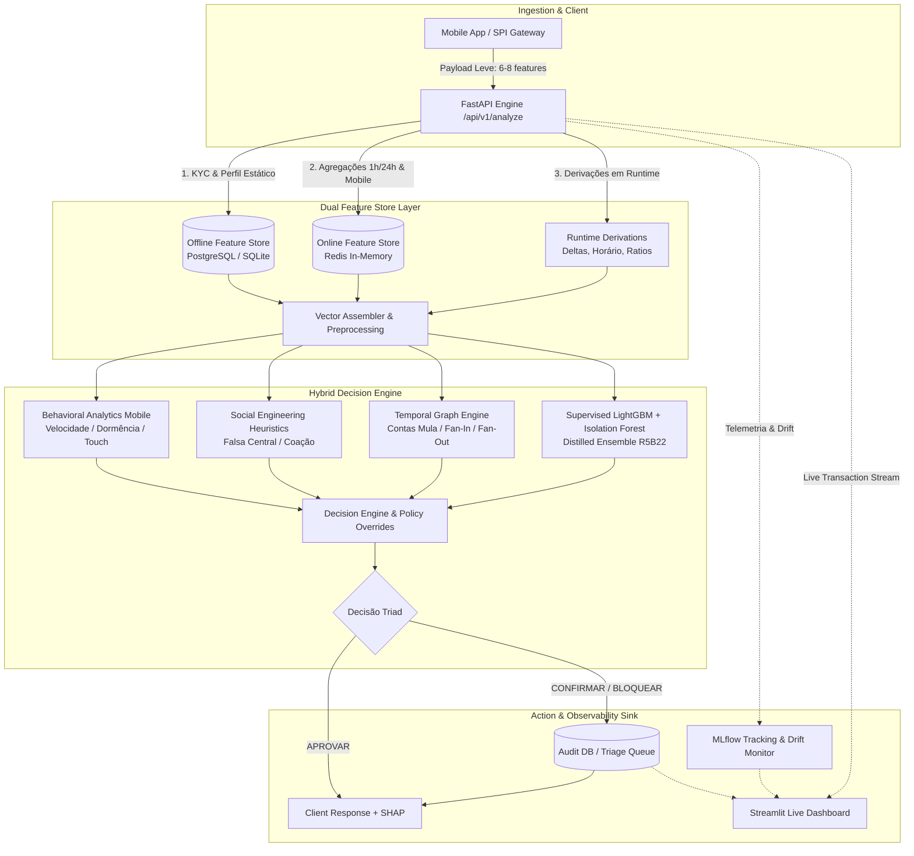

# 🛡️ Sentinel-PIX: Enterprise Real-Time Anti-Fraud & MLOps Engine

[](https://www.python.org/)
[](https://fastapi.tiangolo.com/)
[](https://streamlit.io/)
[](https://mlflow.org/)
[](https://redis.io/)
[](https://www.docker.com/)
[]()

> **Motor Híbrido de Detecção de Fraudes em Pagamentos Instantâneos (PIX) em Tempo Real com Arquitetura Multi-Camadas, Dual Feature Store (Redis + SQL), Explicabilidade SHAP, Governança MLOps (MLflow), Detecção Contínua de Data Drift e Dashboard Interativo de Monitoramento.**

---

## 📌 Visão Geral do Projeto

No ecossistema de pagamentos instantâneos (PIX), a prevenção a fraudes exige **decisões em milissegundos (< 25ms)** equilibrando a interceptação de perdas financeiras com a fricção ao cliente legítimo. 

O **Sentinel-PIX** implementa uma arquitetura **Defense-in-Depth** com três ações operacionais:
- `APROVAR`: Transação liberada automaticamente em baixa latência.
- `CONFIRMAR`: Fricção inteligente — retenção para step-up com biometria facial ou 2FA.
- `BLOQUEAR`: Interceptação preventiva imediata de transações de alto risco e registro automático na Mesa de Investigação.

---

## 🏛️ Arquitetura do Sistema



---

## 🚀 Principais Destaques de Engenharia & MLOps

### 1. Dual Feature Store Strategy
- **Ingestão Leve:** A API recebe apenas o payload transacional essencial (`transaction_id`, `account_id`, `receiver_pix_key`, `amount`, `device_id`, etc.).
- **Offline Feature Store (PostgreSQL / SQLite):** Serve atributos cadastrais de baixa volatilidade (tempo de conta, score de crédito, limites diurno/noturno, flags KYC).
- **Online Feature Store (Redis):** Serve em sub-milissegundos agregados de alta frequência (contadores e volumes em janelas deslizantes de 1h/24h, velocidade de digitação mobile, telemetria de bateria/dispositivo).

### 2. Motor Híbrido Multi-Camadas (Baseline R5B22)
- **LightGBM Supervisionado Destilado:** Treinado sobre 78 features catalogadas com função de perda balanceada.
- **Isolation Forest Não-Supervisionado:** Detecta anomalias e novos padrões de ataque desconhecidos (*zero-day*).
- **Engenharia Social (SE):** Heurísticas especializadas para padrões de golpe (ex: *Golpe da Falsa Central*, *Golpe do Falso Motoboy*, *Pressão Psicológica*).
- **Análise Comportamental (BEH):** Avalia quebra de rotina do cliente no app mobile e anomalias de dispositivo.
- **Graph Engine:** Mapeia redes de relacionamento em tempo real e calcula scores de contas mulas (*mule rings*).

### 3. Explicabilidade SHAP em Tempo Real
- Cálculo local de **SHAP Values** para cada inferência, retornando exatamente os fatores que puxaram o score para cima ou para baixo.

### 4. MLOps & Monitoramento de Data Drift
- **MLflow Tracking:** Registro de rodadas de homologação, artefatos serializados e matrizes de confusão.
- **Detector de Drift em Tempo Real:** Cálculo contínuo de **PSI (Population Stability Index)** e teste de Kolmogorov-Smirnov comparando a distribuição do stream com a base de treino.

---

## 📊 Métricas Oficiais de Produção (R5B22)

Validado sobre **113.844 transações** (1.465 fraudes confirmadas e 112.379 legítimas):

| Métrica | Performance | Meta Operacional |
|---|---:|:---:|
| **Recall Global** | **99,86%** (1.463/1.465 fraudes) | ≥ 99,0% |
| **Taxa de Falso Positivo (FPR)** | **0,957%** (abaixo de 1%) | < 1,0% |
| **Precisão em BLOQUEAR** | **65,65%** | Maximizar |
| **Fraudes perdidas em APROVAR** | **Apenas 2** em 111k | ≤ 5 |
| **Latência Média p95** | **< 15 ms** | SLA < 25 ms |

---

## 🖥️ Live Dashboard em Streamlit

O projeto inclui um **Cockpit Operacional completo**:
1. **Live Cockpit:** Acompanhamento em tempo real da vazão (TPS), proporção de decisões e latência.
2. **Mesa de Investigação:** Dossiê de transações retidas (`CONFIRMAR` e `BLOQUEAR`) com gráfico de barras SHAP, regras disparadas, visualizador de grafos e botões de ação do analista.
3. **MLOps & Drift Observatory:** Monitor de PSI de variáveis críticas e status dos serviços.
4. **Simulador de Ataques:** Injeção ao vivo de cenários de ataque (*Falsa Central*, *Mule Ring Burst*, *Esvaziamento Noturno*).

---

## ⚡ Como Executar

### Opção 1: Via Docker Compose (Recomendado)

Suba toda a infraestrutura (API + Redis + Dashboard) com um único comando:

```bash
docker compose up --build
```

- **API REST (Swagger UI):** [http://localhost:8000/docs](http://localhost:8000/docs)
- **Streamlit Live Dashboard:** [http://localhost:8501](http://localhost:8501)

---

### Opção 2: Execução Local (Python)

1. **Criar e ativar o ambiente virtual:**
```bash
python -m venv venv
venv\Scripts\activate        # Windows
# source venv/bin/activate   # Linux/macOS
```

2. **Instalar dependências:**
```bash
pip install -r requirements.txt
```

3. **Popular as Feature Stores com dados sintéticos:**
```bash
python -m backend.feature_store.seed_stores
```

4. **Iniciar a API FastAPI:**
```bash
uvicorn backend.api:app --host 0.0.0.0 --port 8000 --reload
```

5. **Iniciar o Dashboard Streamlit (em outro terminal):**
```bash
streamlit run dashboard/app.py
```

---

## 🧪 Testes Automatizados

Para rodar a suíte completa de testes unitários e de integração:

```bash
pytest
```

---

## 📂 Estrutura do Repositório

```text
rebuild_pix/
├── backend/
│   ├── api.py                     # API FastAPI REST com enriquecimento em tempo real
│   ├── config.py                  # Configurações globais (Redis, SQL, MLflow, SLA)
│   ├── artefatos/                 # Modelos serializados (LGBM, IF) e metadados R5B22
│   ├── core/                      # Motores analíticos (Behavioral, Graph, SE, Engine)
│   ├── feature_store/             # Camada Dual Feature Store (SQL + Redis)
│   ├── mlops/                     # Tracking MLflow, Audit Logger e Drift Detector
│   └── simulator/                 # Gerador contínuo de tráfego sintético e ataques
├── dashboard/
│   └── app.py                     # Streamlit Cockpit, Mesa de Fraude e SHAP Viewer
├── docs/                          # Documentações técnicas e de negócio
├── tests/                         # Suíte de testes automatizados com pytest
├── Dockerfile.api                 # Container da API
├── Dockerfile.dashboard           # Container do Dashboard
├── docker-compose.yml             # Orquestrador multi-container
└── requirements.txt               # Dependências do projeto
```

---

## 📜 Licença e Conformidade

Este projeto foi reestruturado para fins de portfólio pessoal e demonstração técnica. Todos os dados demográficos, contas e transações utilizados na demonstração são **100% sintéticos e modelados estatisticamente**, em estrita conformidade com a LGPD e boas práticas de privacidade de dados.
