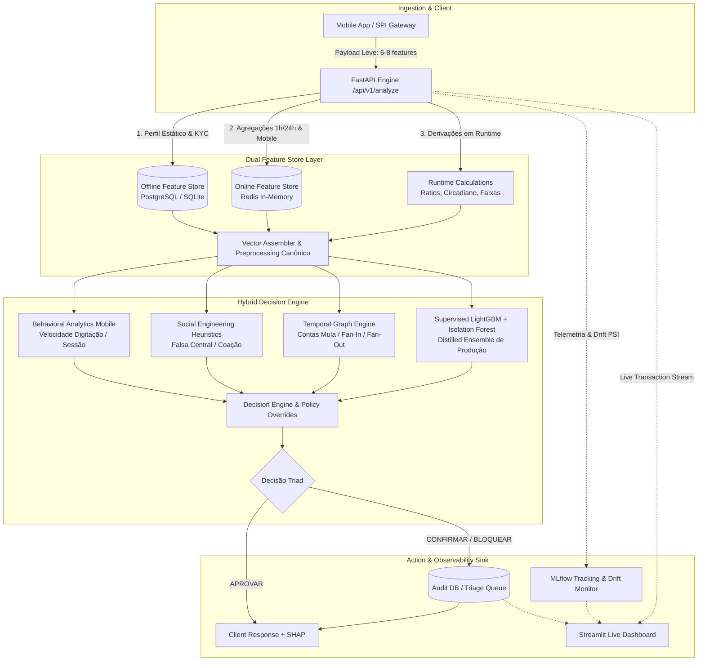

# 🛡️ Sentinel-PIX: Motor Antifraude em Tempo Real & Plataforma MLOps

<div align="center">

[](https://www.python.org/)
[](https://fastapi.tiangolo.com/)
[](https://streamlit.io/)
[](https://mlflow.org/)
[](https://redis.io/)
[](https://www.docker.com/)
[](LICENSE)
[]()

**[🇺🇸 English Version](README.md)** | **[🇧🇷 Versão em Português](README_PT.md)**

</div>

> **Motor Híbrido de Detecção de Fraudes em Pagamentos Instantâneos (PIX) em Tempo Real com Arquitetura Multi-Camadas, Dual Feature Store (Redis + PostgreSQL/SQLite), Explicabilidade SHAP, Governança MLOps (MLflow), Detecção Contínua de Data Drift e Dashboard Interativo de Monitoramento.**

---

## 📌 Visão Geral do Projeto

No ecossistema de pagamentos instantâneos (PIX), a prevenção a fraudes exige **decisões em milissegundos (< 25ms)** equilibrando a interceptação de perdas financeiras com a mínima fricção para o cliente legítimo.

O **Sentinel-PIX** implementa uma arquitetura **Defense-in-Depth** com três ações operacionais:
- **`APROVAR` (`APPROVE`):** Transação liberada automaticamente em baixa latência (< 15ms).
- **`CONFIRMAR` (`CONFIRM`):** Fricção inteligente — retenção temporária para validação por biometria facial ou 2FA.
- **`BLOQUEAR` (`BLOCK`):** Interceptação preventiva imediata de transações de alto risco e envio automático para a Mesa de Investigação.

---

## 🏛️ Arquitetura do Sistema



---

## 🚀 Destaques de Engenharia & Machine Learning

### 1. Estratégia Dual Feature Store (Zero Training-Serving Skew)
- **Ingestão Leve:** A API recebe apenas o payload transacional essencial (**6 a 8 atributos**): `account_id`, `receiver_pix_key`, `amount`, `timestamp`, `device_id`, `channel`.
- **Offline Feature Store (PostgreSQL / SQLite):** Serve atributos cadastrais de baixa volatilidade (tempo de conta, score de crédito, renda mensal, limites diurno/noturno, flags PEP).
- **Online Feature Store (Redis):** Serve em sub-milissegundos agregados de alta frequência (contadores e volumes em janelas de 1h/24h, velocidade de digitação mobile, score de reputação de contas mulas).
- **Reconstrução Canônica (`preprocessing.py`):** Reconstrói deterministamente o vetor completo de 55 features canônicas antes da inferência nos modelos.

### 2. Motor Híbrido Multi-Camadas
- **LightGBM Supervisionado Destilado:** Treinado com foco em alto recall e função de perda balanceada.
- **Isolation Forest Não-Supervisionado (800 Árvores):** Detecta anomalias e novos padrões de ataque desconhecidos (*zero-day*).
- **Engenharia Social (SE):** 8 heurísticas especializadas (ex: *Golpe da Falsa Central*, *Golpe do Falso Motoboy*, *Coação/Sequestro*).
- **Análise Comportamental (BEH):** 6 fatores comportamentais livres de leakage (duração de sessão mobile, quebra de rotina).
- **Graph Investigation Engine:** Algoritmos topológicos que identificam anéis de contas mulas, contas ponte e fan-out acelerado.

### 3. Explicabilidade SHAP em Tempo Real
- Cálculo local de valores de Shapley (`shap.TreeExplainer`) por transação, retornando os fatores determinantes que aumentaram ou reduziram o risco.

### 4. Governança MLOps & Monitoramento de Data Drift
- **MLflow Tracking:** Registro de rodadas de homologação, artefatos serializados, parâmetros e matrizes de confusão.
- **Detector de Data Drift em Tempo Real:** Cálculo contínuo de **PSI (Population Stability Index)** e teste de Kolmogorov-Smirnov sobre janelas deslizantes de observação.

---

## 📊 Métricas Oficiais de Produção

Validado sobre **113.844 transações** (1.465 fraudes confirmadas e 112.379 legítimas):

| Métrica | Performance | Meta Operacional |
|---|---:|:---:|
| **Recall Global** | **99,86%** (1.463 / 1.465 fraudes detectadas) | ≥ 99,0% |
| **Taxa de Falso Positivo (FPR)** | **0,957%** (abaixo de 1%) | < 1,0% |
| **Precisão em BLOQUEAR** | **65,65%** | Maximizar |
| **Fraudes perdidas em APROVAR** | **Apenas 2 casos** em 111k | ≤ 5 |
| **Latência Média p95** | **< 15 ms** | SLA < 25 ms |

---

## 🖥️ Live Dashboard em Streamlit

O projeto inclui um **Cockpit Operacional completo**:
1. **Live Cockpit:** Acompanhamento em tempo real da vazão (TPS), proporção de decisões calibrada com as taxas reais de mercado (95,0% Aprovação, 3,5% Confirmação, 1,5% Bloqueio) e distribuição de latência.
2. **Mesa de Investigação:** Dossiê de casos suspeitos (`CONFIRMAR` e `BLOQUEAR`) com gráfico de barras SHAP, grafo interativo de contas mulas em 2D (`networkx` + `plotly`) e parecer do analista.
3. **MLOps & Modelo de Produção:** Matriz de confusão operacional, métricas consolidadas do MLflow e monitor de PSI em tempo real.
4. **Linhagem de Dados (Data Lineage):** Mapa visual dos 4 blocos de features (Ingestão RT, Offline SQL, Online Redis e Runtime).
5. **Simulador Interativo:** Disparo de transações manuais e presets de cenários de ataque.

---

## ⚡ Como Executar

### Opção 1: Via Docker Compose (Recomendado)

Suba toda a infraestrutura (API + Redis + Dashboard) com um único comando:

```bash
docker compose up --build
```

- **API REST (Swagger UI):** [http://localhost:8000/docs](http://localhost:8000/docs)
- **Streamlit Live Dashboard:** [http://localhost:8501](http://localhost:8501)

---

### Opção 2: Execução Local (Python)

1. **Criar e ativar o ambiente virtual:**
```bash
python -m venv venv
# No Windows:
venv\Scripts\activate
# No Linux/macOS:
source venv/bin/activate
```

2. **Instalar dependências:**
```bash
pip install -r requirements.txt
```

3. **Popular as Feature Stores com dados sintéticos (100% LGPD/GDPR):**
```bash
python -m backend.feature_store.seed_stores
```

4. **Iniciar a API FastAPI:**
```bash
uvicorn backend.api:app --host 0.0.0.0 --port 8000
```

5. **Iniciar o Dashboard Streamlit (em outro terminal):**
```bash
streamlit run dashboard/app.py
```

6. **Executar o Simulador de Tráfego em Tempo Real:**
```bash
# Lote completo calibrado de 1.000 transações (950 Normal / 35 Confirm / 15 Block)
python -m backend.simulator.generator --url http://localhost:8000 --count 1000

# Forçar cenário de ataque específico:
python -m backend.simulator.generator --url http://localhost:8000 --scenario GOLPE_FALSA_CENTRAL --count 10
```

---

## 🧪 Testes Automatizados

Para rodar a suíte completa de testes unitários e de integração:

```bash
pytest
```

**Cobertura de Testes (29/29 Passando):**
- `tests/test_sentinel_e2e.py`: Resolução da Dual Feature Store, enriquecimento com payload leve, explicabilidade SHAP, auditoria de casos e cálculo de drift PSI.
- `tests/test_api_smoke.py`: Health check, SLAs de API e endpoints `/api/v1/analyze` e `/api/v1/batch`.
- `tests/test_severity_policy.py`: Políticas de severidade de produção.
- `tests/test_graph_engineering.py`: Análise topológica de grafos, heurísticas de contas mulas e tolerância a nulos.

---

## 📂 Estrutura do Repositório

```text
rebuild_pix/
├── backend/
│   ├── api.py                     # API FastAPI REST com enriquecimento em tempo real
│   ├── config.py                  # Configurações globais (Redis, SQL, MLflow, SLA)
│   ├── artefatos/                 # Modelos serializados (LGBM, IF) e metadados de produção
│   ├── core/                      # Motores analíticos (Behavioral, Graph, SE, Engine)
│   ├── feature_store/             # Camada Dual Feature Store (SQL + Redis + Seed)
│   ├── mlops/                     # Tracking MLflow, Audit Logger e Drift Detector
│   └── simulator/                 # Gerador contínuo de tráfego sintético e ataques
├── dashboard/
│   └── app.py                     # Streamlit Cockpit, Mesa de Fraude e SHAP Viewer
├── docs/                          # Documentações técnicas e de arquitetura
├── tests/                         # Suíte de testes automatizados com pytest (29 testes)
├── Dockerfile.api                 # Container da API
├── Dockerfile.dashboard           # Container do Dashboard
├── docker-compose.yml             # Orquestrador multi-container
├── requirements.txt               # Dependências do projeto
├── README.md                      # Documentação em Inglês
└── README_PT.md                   # Documentação em Português
```

---

## 📜 Conformidade e Privacidade de Dados

Este projeto foi reestruturado para fins de portfólio pessoal e demonstração técnica. Todos os dados demográficos, contas, telemetrias e eventos transacionais utilizados na simulação são **100% sintéticos e modelados estatisticamente**, em estrita conformidade com a Lei Geral de Proteção de Dados e o Regulamento Geral sobre a Proteção de Dados (**LGPD/GDPR**).
