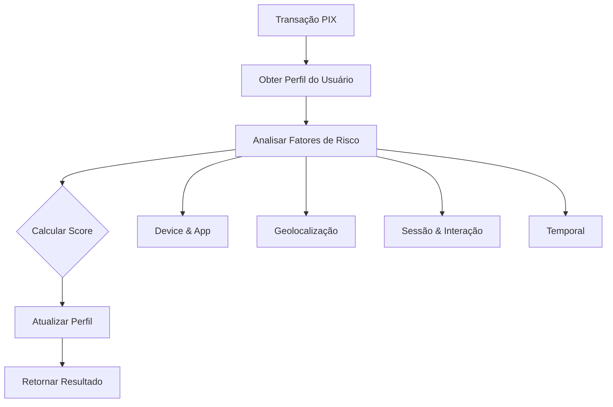

# 📊 Behavioral Analytics v2.1 - Documentação Técnica

## Visão Geral

O módulo **Behavioral Analytics v2.1** realiza análise comportamental avançada do usuário para detecção de fraudes em transações PIX. Analisa padrões de dispositivo, geolocalização, sessão e interação para identificar anomalias que indicam possível fraude, conta comprometida ou coação. A versão 2.1 adiciona integração com o **Sistema Topaz** (FICO/Grupo Stefanini), um sistema antifraude amplamente utilizado por bancos brasileiros.

### Arquivos do Módulo
- `backend/app/core/behavioral_analytics.py` - Módulo principal de análise
- `backend/app/core/user_profile_manager.py` - Gerenciamento de perfis comportamentais

---

## 🎯 Fatores de Risco Detectados

O módulo v2.1 detecta **5 novos fatores Topaz** além dos fatores v2.0, totalizando **23 fatores**:

### Fatores Originais (v1.0)

#### 1. DEVICE_NOVO
**Descrição:** Primeiro acesso de um dispositivo desconhecido.

**Derivação:** Baseado em histórico de `device_name` por CPF.

**Lógica:**
```python
if device_id not in profile.dispositivos_conhecidos:
    # Flag como DEVICE_NOVO
```

**Peso:** 3  
**Score:** +25 pontos

---

#### 2. GEO_VPN_DATACENTER
**Descrição:** Acesso via datacenter ou VPN detectado.

**Derivação:** Baseado em análise de `ip_address` usando serviço GeoIP.

**Lógica:**
```python
if geo_data.get("is_hosting"):
    # IP pertence a datacenter/VPN
```

**Peso:** 4  
**Score:** +40 pontos

---

#### 3. GEO_INTERNACIONAL
**Descrição:** Acesso fora do Brasil.

**Derivação:** País do IP diferente de "Brazil".

**Lógica:**
```python
if geo_country and geo_country != "Brazil":
    # Acesso internacional
```

**Peso:** 3  
**Score:** +30 pontos

---

#### 4. TYPING_ANORMAL
**Descrição:** Padrão de digitação fora do histórico.

**Derivação:** Comparação de `tempo_interacao_ms` com `vl_tempo_interacao_medio_trimestre`.

**Lógica:**
```python
if tempo_interacao < media * 0.4 or tempo_interacao > media * 2.5:
    # Padrão anormal
```

**Peso:** 2  
**Score:** +20 pontos

---

#### 5. SESSAO_CURTA_ALTO_VALOR
**Descrição:** Sessão muito curta para transação de alto valor.

**Derivação:** `tempo_interacao_ms` vs `vl_razao_pix_limite`.

**Lógica:**
```python
if vl_razao_pix_limite >= 0.5 and duration_seconds < 60:
    # Sessão suspeita
```

**Peso:** 2  
**Score:** +15 pontos

---

#### 6. LOGIN_SENHA_ALTO_VALOR
**Descrição:** Login por senha (não biometria) em transação de alto valor.

**Derivação:** `metodo_autenticacao` == "senha" e `vl_razao_pix_limite` >= 0.3.

**Lógica:**
```python
if login_method == "senha" and razao >= 0.3:
    # Método de login menos seguro
```

**Peso:** 1  
**Score:** +10 pontos

---

### Novos Fatores (v2.0)

#### 7. HORARIO_ATIPICO_USUARIO
**Descrição:** Transação em horário incomum para o usuário.

**Derivação:** Baseado em `data_hora_inicio` e distribuição horária histórica do CPF.

**Lógica:**
```python
hora = dt_transacao.hour
freq_pct = distribuicao_horaria[hora] / total_transacoes

if freq_pct < 0.05:  # < 5% de frequência
    # Horário atípico
```

**Fórmula:**
- Extrai hora (0-23) da transação
- Compara com histórico: `freq(hora) / total_tx`
- Se frequência < 5% → suspeito

**Peso:** 2  
**Score:** +15 pontos

**Exemplo:**
- Cliente sempre transaciona entre 9h-18h
- Transação às 2h da manhã → ALERTA

---

#### 8. SESSAO_MUITO_RAPIDA
**Descrição:** Interação muito rápida para transação de alto valor.

**Derivação:** `tempo_interacao_ms` < 30s E `vl_razao_pix_limite` > 0.5.

**Lógica:**
```python
if tempo_interacao_ms < 30000 and vl_razao_pix_limite > 0.5:
    # Pressa ou automação
```

**Peso:** 2  
**Score:** +15 pontos

**Threshold:** < 30 segundos para transação > 50% do limite

**Indicação:** Automação, bot ou fraudador com urgência.

---

#### 9. SESSAO_MUITO_LONGA
**Descrição:** Sessão anormalmente longa comparada ao padrão do usuário.

**Derivação:** `tempo_interacao_ms` vs histórico individual.

**Lógica:**
```python
if tempo_interacao > profile.tempo_interacao_medio * 3:
    # Hesitação ou coação
```

**Threshold:** > 3x a média individual

**Peso:** 2  
**Score:** +15 pontos

**Indicação:** Hesitação (vítima em dúvida) ou coação (sob ameaça).

---

#### 10. LATENCIA_REDE_ANORMAL_ALTA
**Descrição:** Latência de rede muito alta.

**Derivação:** `latencia_rede_ms` > 500ms.

**Lógica:**
```python
if latencia_rede_ms > 500:
    # Proxy/VPN/conexão suspeita
```

**Threshold:** > 500ms

**Peso:** 2  
**Score:** +15 pontos

**Indicação:** Uso de proxy, VPN ou rede internacional.

---

#### 11. LATENCIA_REDE_ANORMAL_BAIXA
**Descrição:** Latência de rede suspeita (muito baixa).

**Derivação:** `latencia_rede_ms` < 10ms.

**Lógica:**
```python
if latencia_rede_ms < 10:
    # Possível automação ou emulador
```

**Threshold:** < 10ms

**Peso:** 1  
**Score:** +10 pontos

**Indicação:** Script automatizado ou ambiente controlado.

---

#### 12. IP_NOVO_ALTO_VALOR
**Descrição:** IP nunca visto em transação de alto valor.

**Derivação:** `ip_address` não está em histórico do CPF E `vl_razao_pix_limite` >= 0.5.

**Lógica:**
```python
if ip_address not in profile.ips_conhecidos and razao >= 0.5:
    # Combinação de alto risco
```

**Peso:** 3  
**Score:** +25 pontos

**Indicação:** Possível acesso não autorizado.

---

#### 13. TYPING_SPEED_DEVIATION
**Descrição:** Velocidade de interação muito diferente do padrão individual.

**Derivação:** Desvio > 2σ da média individual de `tempo_interacao_ms`.

**Lógica:**
```python
diff = abs(tempo_interacao - profile.tempo_interacao_medio)
desvio_padrao = profile.tempo_interacao_desvio

if diff > 2 * desvio_padrao:
    # Muito rápido ou muito lento
```

**Fórmula:**
```
z_score = |tempo_atual - média_individual| / desvio_padrão
if z_score > 2: ALERTA
```

**Peso:** 2  
**Score:** +15 pontos

**Indicação:** Automação (rápido) ou coação/hesitação (lento).

---

#### 14. LOGIN_METHOD_CHANGE_HIGH_VALUE
**Descrição:** Mudança no método de login em transação de alto valor.

**Derivação:** `metodo_autenticacao` diferente do habitual E `vl_razao_pix_limite` >= 0.3.

**Lógica:**
```python
if metodo_atual != profile.metodo_login_mais_usado and razao >= 0.3:
    # Mudança suspeita
```

**Peso:** 2  
**Score:** +15 pontos

**Exemplo:**
- Cliente sempre usa biometria
- Agora usou senha em transação alta → ALERTA

---

#### 15. FREQUENCIA_BURST
**Descrição:** Múltiplas transações em intervalo muito curto.

**Derivação:** 3+ transações em janela de 5 minutos.

**Lógica:**
```python
recent_tx = [t for t in history if t >= (now - 5min)]

if len(recent_tx) >= 3:
    # Burst detectado
```

**Threshold:** 3+ transações em < 5 minutos

**Peso:** 3  
**Score:** +20 pontos

**Indicação:** Automação ou conta comprometida sendo drenada.

---

#### 16. APP_VERSION_DESATUALIZADA
**Descrição:** Versão do app muito antiga.

**Derivação:** Comparação de `app_version` com versão mais recente.

**Lógica:**
```python
current_minor = extract_minor_version(app_version)
latest_minor = extract_minor_version(LATEST_VERSION)

if (latest_minor - current_minor) > 3:
    # Mais de 3 releases atrás
```

**Threshold:** > 3 minor versions atrás

**Peso:** 1  
**Score:** +10 pontos

**Indicação:** Device comprometido ou não atualizado (vulnerável).

---

#### 17. DEVICE_MULTIPLOS_CPFS
**Descrição:** Dispositivo usado por múltiplos CPFs diferentes.

**Derivação:** Rastreamento de `device_name` por CPFs.

**Lógica:**
```python
cpfs_using_device = device_to_cpfs[device_name]

if len(cpfs_using_device) >= 3:
    # Conta laranja ou fraude
```

**Threshold:** 3+ CPFs diferentes

**Peso:** 4  
**Score:** +30 pontos

**Indicação:** Conta laranja ou quadrilha usando mesmo device.

---

#### 18. INTERVALO_ZERADO_SEQUENCIAL
**Descrição:** Transações simultâneas (intervalo 0) repetidas vezes.

**Derivação:** `qt_intervalo_transacao_minuto` == 0 múltiplas vezes.

**Lógica:**
```python
if intervalo_tx == 0 and len(recent_history) >= 2:
    # Transações simultâneas
```

**Peso:** 2  
**Score:** +15 pontos

**Indicação:** Automação ou script executando múltiplas transações.

---

#### 19. PRIMEIRO_PIX_ALTO_CLIENTE_NOVO
**Descrição:** Cliente novo fazendo primeiro envio de alto valor.

**Derivação:** Combinação de múltiplos fatores de risco.

**Lógica:**
```python
if (qt_tempo_relacionamento_mes < 3 and 
    tp_primeiro_envio_recebedor_trimestre == 1 and
    vl_razao_pix_limite >= 0.5):
    # Combinação de alto risco
```

**Condições:**
- Cliente novo (< 3 meses)
- Primeiro envio ao destinatário
- Valor alto (≥ 50% limite)

**Peso:** 4  
**Score:** +30 pontos

**Indicação:** Golpe de conta nova ou conta aberta para fraude.

---

## 🧠 Classe UserBehaviorProfile

### Estrutura

```python
@dataclass
class UserBehaviorProfile:
    cpf: str
    dispositivos_conhecidos: Set[str]
    ips_conhecidos: Set[str]
    hora_mais_frequente: int  # 0-23
    distribuicao_horaria: Dict[int, float]
    tempo_interacao_medio: float  # ms
    tempo_interacao_desvio: float  # ms
    metodo_login_mais_usado: str
    intervalo_medio_entre_tx: float  # minutos
    valor_medio_transacao: float
    ultima_atualizacao: datetime
    app_versions_conhecidas: Set[str]
    total_transacoes: int
```

### Atualização do Perfil

O perfil é atualizado **após cada transação** usando média móvel exponencial:

```python
# Média Móvel Exponencial (α = 0.2)
novo_valor = valor_anterior + α * (observacao - valor_anterior)

# Exemplo para tempo de interação:
profile.tempo_interacao_medio += 0.2 * (tempo_atual - profile.tempo_interacao_medio)
```

**Vantagens:**
- Adaptação gradual a mudanças de comportamento
- Maior peso para transações recentes
- Baixo custo computacional (O(1))

---

## 🔧 UserProfileManager

### Funcionalidades

#### 1. Gerenciamento de Perfis

```python
manager = UserProfileManager(ttl_days=90)

# Obter perfil (cria default se não existir)
profile = manager.get_profile("12345678901")

# Atualizar com nova transação
manager.update_profile(
    cpf="12345678901",
    device_name="iPhone 15",
    ip_address="192.168.1.1",
    hora_transacao=14,
    tempo_interacao_ms=45000.0,
    metodo_login="biometria",
    valor=1500.0,
    app_version="7.30.0"
)
```

#### 2. Verificações de Anomalia

```python
# Verificar se hora é atípica
is_atipico = manager.is_hora_atipica(cpf, hora=2)  # 2am

# Verificar tempo de interação
is_anormal, razao = manager.is_tempo_interacao_anormal(cpf, tempo_ms)
# Retorna: (True, "MUITO_RAPIDO") ou (True, "MUITO_LENTO")

# Verificar IP novo
is_novo = manager.is_ip_novo(cpf, "203.0.113.1")

# Verificar device novo
is_novo = manager.is_device_novo(cpf, "Samsung Galaxy S23")

# Verificar app desatualizada
is_old = manager.is_app_version_desatualizada(cpf, "6.20.0", "7.30.0")

# Verificar mudança de método de login
mudou = manager.is_metodo_login_mudou(cpf, "senha")
```

#### 3. Cache e TTL

- **TTL padrão:** 90 dias
- **Limpeza automática:** Perfis expirados são removidos
- **Fallback gracioso:** Perfis ausentes retornam valores default

```python
# Limpar perfis expirados
manager.clear_expired_profiles()

# Obter estatísticas
stats = manager.get_stats()
# Retorna: {
#     "total_profiles": 1500,
#     "active_profiles": 1200,
#     "expired_profiles": 300,
#     "ttl_days": 90
# }
```

---

## 📈 Integração com Dados Mobile

### Dados Requeridos

O módulo consome os seguintes dados de `dados_features_mobile.csv`:

| Campo | Tipo | Uso |
|-------|------|-----|
| `device_name` | string | Identificação de dispositivo |
| `app_version` | string | Versão do app mobile |
| `ip_address` | string | Localização e tipo de rede |
| `latencia_rede_ms` | float | Análise de conexão |
| `tempo_interacao_ms` | float | Padrão de interação |
| `metodo_autenticacao` | string | Método de login |
| `session_id` | string | Identificação de sessão |
| `data_hora_inicio` | datetime | Análise temporal |

### Mapeamento de Campos

```python
# De dados_features_mobile.csv
device_name -> DeviceInfo.device_model
app_version -> DeviceInfo.app_version
ip_address -> DeviceInfo.ip_address
session_id -> SessionInfo.session_id
metodo_autenticacao -> SessionInfo.login_method
tempo_interacao_ms -> SessionInfo.duration_seconds
latencia_rede_ms -> SessionInfo.network_latency_ms
```

---

## ⚙️ Configuração de Thresholds

### Thresholds Configuráveis

Os thresholds podem ser ajustados conforme a sensibilidade desejada:

```python
class BehavioralAnalytics:
    VERSAO_APP_MAIS_RECENTE = "7.30.0"
    
    # Thresholds (podem ser parametrizados)
    HORARIO_ATIPICO_PCT = 0.05  # 5% de frequência
    SESSAO_RAPIDA_SEGUNDOS = 30
    SESSAO_LONGA_MULTIPLICADOR = 3.0
    LATENCIA_ALTA_MS = 500
    LATENCIA_BAIXA_MS = 10
    IP_NOVO_RAZAO_LIMITE = 0.5
    TYPING_DEVIATION_SIGMAS = 2.0
    BURST_COUNT = 3
    BURST_WINDOW_MINUTES = 5
    APP_VERSION_LAG = 3  # releases
    DEVICE_MULTIPLOS_CPFS_MIN = 3
    CLIENTE_NOVO_MESES = 3
```

### Ajuste de Pesos

Pesos podem ser ajustados baseado em análise de falsos positivos:

```python
# Pesos atuais (0-4)
PESOS = {
    "DEVICE_NOVO": 3,
    "HORARIO_ATIPICO_USUARIO": 2,
    "IP_NOVO_ALTO_VALOR": 3,
    "DEVICE_MULTIPLOS_CPFS": 4,
    "PRIMEIRO_PIX_ALTO_CLIENTE_NOVO": 4,
    # ... outros
}
```

---

## 📊 Cálculo do Behavioral Score

### Fórmula

```
behavioral_score = min(100, Σ(peso_i × pontos_i))
```

Onde:
- `peso_i` = peso do fator (1-4)
- `pontos_i` = pontuação base do fator (10-40)
- Score final limitado a 100

### Interpretação

| Score | Nível | Ação Recomendada |
|-------|-------|------------------|
| 0-24 | BAIXO | Aprovar |
| 25-49 | MÉDIO | Revisar |
| 50-74 | ALTO | Bloquear + Análise |
| 75-100 | CRÍTICO | Bloquear + Investigação |

---

## 🔄 Fluxo de Análise



---

## 💡 Casos de Uso Reais

### Caso 1: Golpe de WhatsApp

**Cenário:** Fraudador obtém acesso ao WhatsApp da vítima e solicita dinheiro.

**Detecções:**
- `DEVICE_NOVO` (device do fraudador)
- `IP_NOVO_ALTO_VALOR` (IP diferente)
- `SESSAO_MUITO_RAPIDA` (urgência)
- `LOGIN_METHOD_CHANGE_HIGH_VALUE` (senha ao invés de biometria)

**Score:** ~85 (CRÍTICO)

---

### Caso 2: Conta Laranja

**Cenário:** Conta usada por múltiplas pessoas para receber valores ilícitos.

**Detecções:**
- `DEVICE_MULTIPLOS_CPFS` (3+ CPFs no mesmo device)
- `FREQUENCIA_BURST` (múltiplas transações rápidas)
- `INTERVALO_ZERADO_SEQUENCIAL` (automação)

**Score:** ~75 (CRÍTICO)

---

### Caso 3: Cliente Sob Coação

**Cenário:** Vítima forçada a fazer transferência por sequestrador.

**Detecções:**
- `SESSAO_MUITO_LONGA` (hesitação)
- `HORARIO_ATIPICO_USUARIO` (madrugada)
- `TYPING_SPEED_DEVIATION` (padrão anormal)

**Score:** ~50 (ALTO)

---

### Caso 4: Teste de Conta Roubada

**Cenário:** Fraudador testa se conta funciona antes de drenar.

**Detecções:**
- `DEVICE_NOVO`
- `GEO_VPN_DATACENTER` (VPN para esconder origem)
- `SESSAO_MUITO_RAPIDA`
- `FREQUENCIA_BURST` (múltiplos testes)

**Score:** ~90 (CRÍTICO)

---

## 🧪 Como Adicionar Novos Fatores

### Template de Novo Fator

```python
# 1. Adicionar lógica em _real_analysis()
def _real_analysis(self, features, session_data):
    # ... código existente ...
    
    # NOVO FATOR: EXEMPLO_NOVO_FATOR
    if condicao_derivavel_dos_dados:
        risk_factors.append(BehavioralRiskFactor(
            codigo="EXEMPLO_NOVO_FATOR",
            descricao="Descrição clara do que foi detectado",
            peso=2,  # 1-4
            source="device|geo|session|typing"
        ))
        behavioral_score += 15  # 10-40

# 2. Documentar no README
# 3. Adicionar teste no test_behavioral_analytics.py
# 4. Atualizar lista de fatores nesta documentação
```

### Checklist

- [ ] Fator é derivável dos dados disponíveis?
- [ ] Lógica é clara e testável?
- [ ] Threshold foi validado com dados reais?
- [ ] Peso reflete a severidade?
- [ ] Documentação foi atualizada?
- [ ] Teste foi adicionado?

---

## 🏦 Novos Fatores Topaz (v2.1)

A versão 2.1 integra o **Sistema Topaz** (FICO/Grupo Stefanini), um sistema antifraude amplamente utilizado por bancos brasileiros. Os dados Topaz são extraídos das tags XML nas transações da landing `landing_brb_oracle_mbk.aut`.

### Tags Topaz Extraídas

1. `<BRB__ResultadoConsultaScoreTopaz>` - Score de risco (0-5)
2. `<BRB__TopazTransacaoRejeitada>` - Flag de rejeição
3. `<BRB__TopazTransacaoHabilitada>` - Flag de habilitação
4. `<BRB__IsAgendamentoRecorrenteForTopaz>` - Flag de agendamento recorrente
5. `<BRB__SyncIdTopaz>` - ID de sincronização

### Fatores Implementados

#### 20. TOPAZ_RISCO_CRITICO
**Descrição:** Score de risco Topaz crítico (4 ou 5).

**Derivação:** Extração da tag `<BRB__ResultadoConsultaScoreTopaz>` do XML.

**Lógica:**
```python
topaz_score = features.get("topaz_risk_score", -1)
if topaz_score >= 4:
    # Score crítico detectado
```

**Threshold:** Score Topaz >= 4  
**Peso:** 4  
**Score:** +35 pontos  
**Source:** external (sistema Topaz)

**Interpretação:** Sistema Topaz detectou alto risco de fraude (4-5). Recomenda bloqueio.

---

#### 21. TOPAZ_RISCO_ALTO
**Descrição:** Score de risco Topaz alto (3).

**Derivação:** Extração da tag `<BRB__ResultadoConsultaScoreTopaz>` do XML.

**Lógica:**
```python
if topaz_score == 3:
    # Score alto detectado
```

**Threshold:** Score Topaz == 3  
**Peso:** 3  
**Score:** +25 pontos  
**Source:** external

**Interpretação:** Sistema Topaz detectou risco elevado.

---

#### 22. TOPAZ_RISCO_MODERADO
**Descrição:** Score de risco Topaz moderado (2).

**Derivação:** Extração da tag `<BRB__ResultadoConsultaScoreTopaz>` do XML.

**Lógica:**
```python
if topaz_score == 2:
    # Score moderado detectado
```

**Threshold:** Score Topaz == 2  
**Peso:** 2  
**Score:** +15 pontos  
**Source:** external

**Interpretação:** Sistema Topaz detectou risco moderado. Requer atenção.

---

#### 23. TOPAZ_REJEITADA
**Descrição:** Transação previamente rejeitada pelo Topaz.

**Derivação:** Extração da tag `<BRB__TopazTransacaoRejeitada>` do XML.

**Lógica:**
```python
topaz_rejeitada = features.get("topaz_transacao_rejeitada", 0)
if topaz_rejeitada == 1:
    # Transação já foi rejeitada pelo Topaz (VETO)
```

**Threshold:** topaz_transacao_rejeitada == 1  
**Peso:** 5 (VETO)  
**Score:** +50 pontos  
**Source:** external

**Interpretação:** Topaz já havia bloqueado esta transação anteriormente. Possível tentativa de override ou bypass.

---

#### 24. AGENDAMENTO_RECORRENTE (Atenuante)
**Descrição:** PIX é agendamento recorrente (atenuante).

**Derivação:** Extração da tag `<BRB__IsAgendamentoRecorrenteForTopaz>` do XML.

**Lógica:**
```python
is_recorrente = features.get("is_agendamento_recorrente", "")
if is_recorrente.lower() == "true":
    # Agendamento recorrente reduz risco (atenuante)
    behavioral_score = max(0.0, behavioral_score - 10)
```

**Threshold:** is_agendamento_recorrente == "true"  
**Peso:** -1 (atenuante)  
**Score:** -10 pontos  
**Source:** external

**Interpretação:** Padrão previsível e recorrente reduz o risco de fraude.

### Escala de Score Topaz

O sistema Topaz utiliza uma escala de 0-5:

| Score | Interpretação | Ação Recomendada | Peso no Sistema |
|-------|---------------|------------------|-----------------|
| 0-1 | Baixo risco | Aprovar | 0 |
| 2 | Risco moderado | Monitorar | 2 |
| 3 | Risco alto | Revisar manualmente | 3 |
| 4-5 | Risco crítico | Bloquear | 4 |

### Impacto na Detecção

| Melhoria | Impacto | Justificativa |
|----------|---------|---------------|
| **Topaz Risk Score** | 🔴 Alto | Herda inteligência de ML do Topaz sem custo de treinamento |
| **Topaz Rejeitada (Veto)** | 🔴 Alto | Sinal fortíssimo - Topaz já detectou fraude |
| **Agendamento Recorrente** | 🟢 Baixo | Atenuante para reduzir falsos positivos |

---

## 🔐 Considerações de Segurança

### Dados Sensíveis

- **IPs são hasheados** em logs para privacidade
- **CPFs não são expostos** em respostas de API
- **Perfis comportamentais** respeitam LGPD (TTL de 90 dias)

### Falsos Positivos

Para minimizar falsos positivos:

1. **Use combinações de fatores** (não apenas um)
2. **Ajuste thresholds** baseado em dados históricos
3. **Implemente whitelist** para casos conhecidos
4. **Monitore métricas** de precisão e recall

---

## 📚 Referências

- [LGPD - Lei Geral de Proteção de Dados](https://www.planalto.gov.br/ccivil_03/_ato2015-2018/2018/lei/l13709.htm)
- [OWASP - Behavioral Analysis](https://owasp.org/www-community/controls/Blocking_Brute_Force_Attacks)
- [Fraud Detection Best Practices](https://stripe.com/guides/fraud-detection)

---

**Versão:** 2.1  
**Data:** Fevereiro 2026  
**Autor:** Equipe Anomalia PIX
